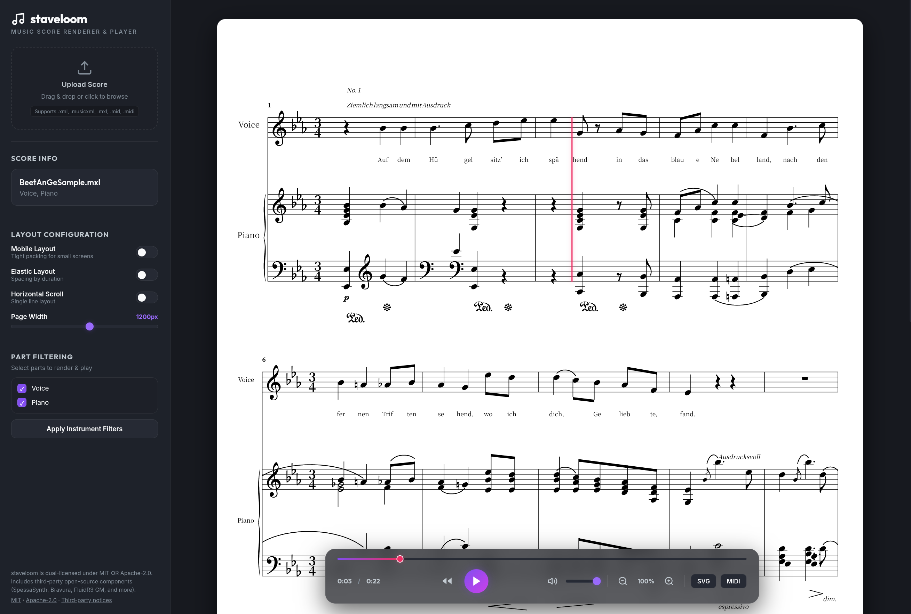

*[한국어 버전](README.ko.md)*

# Staveloom

**Staveloom** is a MusicXML parsing and SVG rendering engine written in Rust. It ships as a CLI tool and a browser-based interactive web player, aiming for publication-quality score output.

> **The web player is fully client-side.** Rendering (WASM), MIDI synthesis (SpessaSynth AudioWorklet), and audio playback all happen entirely in the browser — no server required.



---

## Key Features

### 1. Precise Parsing and a Flexible Data Model

- Broad support for the MusicXML 3.1/4.0 standard, including direct parsing of compressed `.mxl` archives.
- **Non-standard structure tolerance**: parses the quirky XML tree shapes exported by various notation software without choking.
- **Selective part rendering**: the `--parts P1,P2` flag extracts only the specified parts, applied consistently across SVG, MIDI, and audio output.

### 2. A Professional Layout Engine

- **Compact layout (default)**: allocates spacing tightly matched to each note's actual rendered width, maximizing horizontal density.
- **Elastic layout (`--elastic`)**: a non-linear time-to-space mapping ($W \propto duration^{0.6}$) for visually balanced spacing based on note duration.
- **Mobile layout (`--mobile`)**: a preset for narrow screens — compresses margins/spacing further and drops part-name labels after the first system to maximize content area. Auto-detected by viewport width or toggled manually in the web player.
- **Priority-based vertical stacking (11-pass)**: places Dynamics → Octave Shift → Dashes/Bracket → Wedge → Pedal → Segno/Coda → Words → Harmony → Lyrics → Metronome → Rehearsal marks without collisions, via an `OccupancyMap`.
- **Accurate beam/slur rendering**: unified stem direction within a beam group (including protection against cross-voice collisions), slurs anchored to the correct notehead/stem-tip endpoint, and automatic per-staff stem direction for cross-staff grand-staff beams.
- **Guitar/TAB optimizations**: professional bend rendering (curved arrows + "full"/"1/2" text), intelligent stem control, capo support, correct staff-line counts, and key/time signature suppression on TAB staves.
- **Advanced layout features**: nested tuplets (staggered brackets), dynamic wavy lines (linked to trills), rhythmic slash notation, optimized multi-measure rests, visual octave shifts (8va/8vb).

### 3. Audio and MIDI Rendering (CLI)

- **High-quality MP3 synthesis**: `rustysynth` (SF2) + LAME encoding.
- **Standard MIDI export**: multi-track MIDI (SMF Format 1) via `midly`. Converts trills, mordents, arpeggios, tremolos, etc. into actual note sequences.
- **Articulations**: staccato (50% length), tenuto (100%), accent (+30% velocity), fermata extension.

### 4. Playback Metadata and Audio Sync

- **Timeline solver**: fully resolves complex performance order — `<repeat>`, volta endings, D.S., D.C., Segno, Coda.
- **Beat sync**: extracts SVG coordinates (x, y_start, y_end) and absolute time (seconds) for every regular beat and note onset.
- **Dynamic tempo tracking**: analyzes `<sound tempo>` and metronome markings to compute cumulative elapsed time.
- **Anacrusis support**: detects pickup (`implicit`) measures and adjusts the starting offset automatically.

### 5. Interactive Web Player

A fully client-side architecture, built across four phases.

#### Rendering (Phase 1)

- The Rust renderer is built to WASM (`wasm-pack`); `staveloom_wasm_bg.wasm` (1.1 MB) runs entirely in the browser.
- Drag-and-drop MusicXML → WASM parse/render → SVG displayed instantly.
- Elastic/Compact/Mobile layout toggle (with viewport-width-based mobile auto-detection), a page-width slider, and a single-line horizontal scroll mode.
- Part-filtering checkboxes, SVG/MIDI download.

#### Client-Side MIDI Synthesis (Phase 2)

- Real-time SF2 synthesis via **SpessaSynth** (AudioWorklet-based). Per-instrument SF2 loaded on demand.
- **SF2 merge strategy**: multiple SF2s are merged into one via `mergeSF2Buffers()` before a single `addSoundBank()` call, avoiding repeated channel resets.
- **Real-time cursor sync**: sub-frame precision via `currentHighResolutionTime` + `audioLatency` compensation. Re-anchors the visualization clock right after playback starts to minimize initial lag, and auto-scrolls the cursor back into view when it drifts off-screen (aligning to the top when too many parts to fit on one screen).
- **iOS audio handling**: `unlockAudio()` is called synchronously within the user-gesture call stack to create the AudioContext; `play()` is async and awaits `resume()` before starting playback; a `touchstart` listener resumes playback after backgrounding.

#### Virtual SVG Rendering (Phase 3)

A 3-tier strategy that minimizes memory and DOM overhead for large scores:

| System count | Rendering approach |
| ------------- | ------------------- |
| 1 | single SVG mounted directly |
| 2–10 (`COMBINE_THRESHOLD`) | combined into one SVG via `_combineSystems()` |
| 11+ | IntersectionObserver-based virtualization (only in-viewport systems mounted to the DOM) |

- `rootMargin` is computed dynamically as ≈2 system heights, for look-ahead rendering.
- A `fullReset` flag resets scroll/MIDI state only on file replacement (position is preserved across layout toggles).

#### PWA Offline Support (Phase 4)

- **Service Worker** (`sw.js`): cache-first plus dynamic caching, pre-caching 16 static assets; `ignoreSearch: true` ignores the `?v=N` version query. SF2 files are cached dynamically on first use.
- **PWA manifest**: `display: standalone`, 192/512px icons, installable to the home screen.

#### Bravura Font Bundling

- Handles environments without Bravura installed: OTF (500.9 KB) → WOFF2 subset (28.3 KB, 212 glyphs, a 94.3% reduction).
- `@font-face { src: local('Bravura'), url('./fonts/Bravura-subset.woff2') }`: tries the local font first, falls back to the bundled URL.
- `<link rel="preload">` plus `font-display: block` secures the font before the first render, preventing FOUT.

#### Mobile UX

- **Sidebar toggle**: hidden by default on mobile (≤768px); a hamburger (☰) button in the top-left slides it in as an overlay.
- **Two-row toolbar**: row 1 for time/playback, row 2 for volume/zoom/download.
- **Safe area handling**: `viewport-fit=cover` + `env(safe-area-inset-bottom)` + `100dvh` to account for the iOS Safari URL bar and home indicator.

### 6. Verification and Reporting

- JSON/SVG/Timeline/Metadata snapshot regression tests (100% passing).
- A visual verification report based on W3C standard samples (`specification_report.html`).
- `preview.html` (browse all rendered SVGs), `preview_debug.html` (visualizes sync lines).

---

## Installation and Usage

### Building the CLI

```bash
cargo build --release
```

### CLI Options

```bash
# Basic rendering (generate SVG)
cargo run -- <file.musicxml> --output out.svg

# Render only specific parts
cargo run -- <file.musicxml> --parts P1,P2 --output filtered.svg

# Generate MIDI and MP3 audio (CLI only)
cargo run -- <file.musicxml> --midi out.mid --sf2 path/to/font.sf2 --audio out.mp3

# Extract sync metadata (JSON)
cargo run -- <file.musicxml> --metadata sync_data.json

# List parts
cargo run -- <file.musicxml> --list-parts

# Use elastic layout
cargo run -- <file.musicxml> --elastic

# Use mobile layout (dense packing for narrow screens)
cargo run -- <file.musicxml> --mobile

# Single-line horizontal mode
cargo run -- <file.musicxml> --horizontal

# Set page width (default: 1200)
cargo run -- <file.musicxml> --width 800

# Show license and third-party notices
cargo run -- --license
```

### Running the Web Player

```bash
# Build WASM (once initially, or whenever the Rust code changes)
bash wasm-build.sh

# Start the dev server
python3 server.py
```

Open `http://localhost:8000` in a browser and drag and drop an `.xml`, `.musicxml`, or `.mxl` file to use it immediately.

### Regenerating the Bravura Font Subset

```bash
# requires fonttools: pip install fonttools brotli
bash scripts/generate_bravura_subset.sh
# or specify a custom path:
bash scripts/generate_bravura_subset.sh /path/to/Bravura.otf
```

---

## Testing and Verification

### Run the full test suite

```bash
cargo test
```

### Run a specific sample

```bash
TEST_FILTER=bend-element cargo test
```

### Generate the visual verification report

```bash
python3 scripts/generate_report.py
# → generates specification_report.html
```

### SVG preview

```bash
python3 scripts/generate_preview.py
# → generates preview.html
```

### Debugging metadata sync

```bash
cargo test test_all_samples_debug_svg_snapshot
python3 scripts/generate_debug_preview.py
# → generates preview_debug.html
```

---

## Tech Stack

- **Core**: Rust (Edition 2024) — roxmltree, serde, svg, midly, rustysynth, lame
- **WASM**: wasm-pack, wasm-bindgen (`wasm32-unknown-unknown`)
- **Web Player**: Vanilla JS (ES2022), SpessaSynth (AudioWorklet), Service Worker
- **Font**: SMuFL / Bravura (WOFF2 subset, fonttools pyftsubset)
- **Standard**: MusicXML 3.1/4.0
- **Dev Server**: Python 3 standard library

---

## License

This project is dual-licensed under **MIT OR Apache-2.0** — pick whichever
suits you. See [`LICENSE-MIT`](LICENSE-MIT) and
[`LICENSE-APACHE`](LICENSE-APACHE) for the full text.

A review of bundled third-party open-source components (SpessaSynth, the
Bravura font, the FluidR3 GM soundfont, etc.) is in
[`docs/THIRDPARTY_LICENSE.md`](docs/THIRDPARTY_LICENSE.md).
