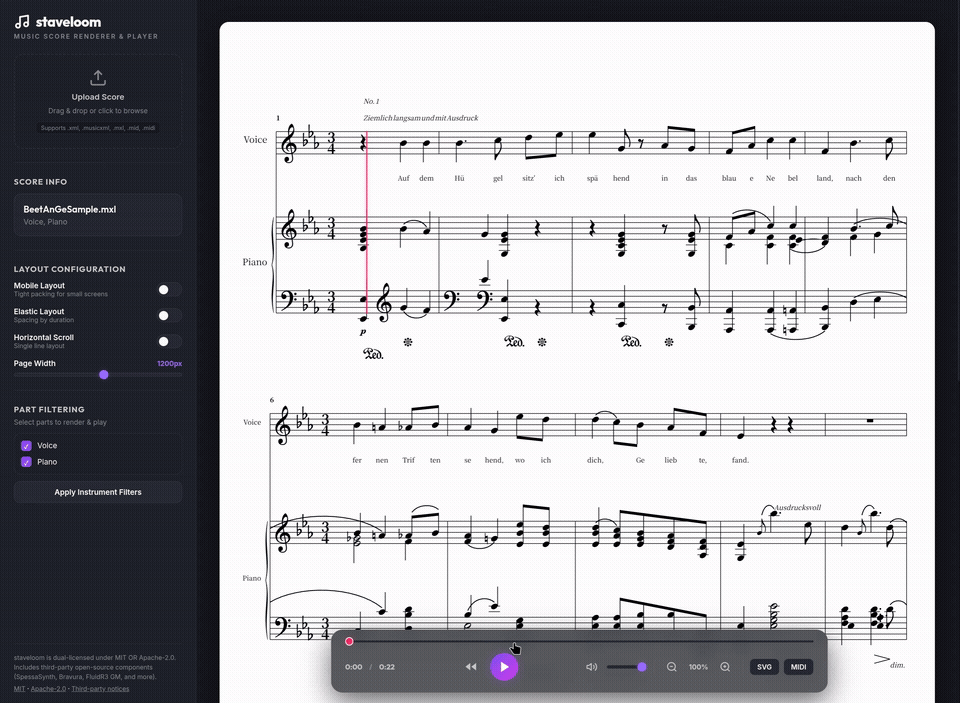

*[한국어 버전](README.ko.md)*

# Staveloom

**Staveloom** is a MusicXML parsing and SVG rendering engine written in Rust, shipped as a CLI tool and a browser-based interactive web player.

> **The web player is fully client-side.** Rendering (WASM), MIDI synthesis (SpessaSynth), and playback all happen in the browser — no server required.

**[Try the live demo →](https://amoriya.github.io/staveloom/)**



---

## Features

- **MusicXML 3.1/4.0 & `.mxl`** parsing, tolerant of the quirky exports from various notation software
- **Three layout modes**: Compact (default), Elastic (duration-based spacing), Mobile (dense, auto-detected on narrow screens)
- **Rich notation support**: beams, slurs/ties, guitar tab & bends, tuplets, ornaments, and collision-free dynamics/lyrics/chord placement
- **MIDI & MP3 export** (CLI): trills/mordents/arpeggios/tremolos expanded into real note sequences
- **Playback sync**: resolves repeats, volta endings, D.S./D.C./Segno/Coda into beat-accurate timing for a score-follow cursor
- **Interactive web player**: drag-and-drop MusicXML or MIDI, real-time SF2 synthesis, virtualized rendering for large scores, installable offline-capable PWA

## Quick Start

### CLI

```bash
cargo build --release
cargo run -- score.musicxml --output score.svg
cargo run -- score.musicxml --midi out.mid --sf2 font.sf2 --audio out.mp3
```

Run with no arguments to see all options (part filtering, layout mode, page width, etc.).

### Web Player

```bash
bash wasm-build.sh   # build WASM once, or after Rust changes
python3 server.py    # start the dev server
```

Open `http://localhost:8000` and drop in a `.xml`, `.musicxml`, `.mxl`, or `.mid` file.

## Tech Stack

Rust (roxmltree, svg, midly, rustysynth, lame) · WASM (wasm-bindgen) · Vanilla JS + SpessaSynth for the web player · SMuFL/Bravura font

## Testing

```bash
cargo test
```

`scripts/generate_report.py` and `scripts/generate_preview.py` render all test samples to browsable HTML (`specification_report.html`, `preview.html`) for visual regression checks.

## License

Dual-licensed under **MIT OR Apache-2.0** — pick whichever suits you. See
[`LICENSE-MIT`](LICENSE-MIT) / [`LICENSE-APACHE`](LICENSE-APACHE).

Third-party components (SpessaSynth, Bravura, FluidR3 GM, etc.) are reviewed in
[`docs/THIRDPARTY_LICENSE.md`](docs/THIRDPARTY_LICENSE.md).
